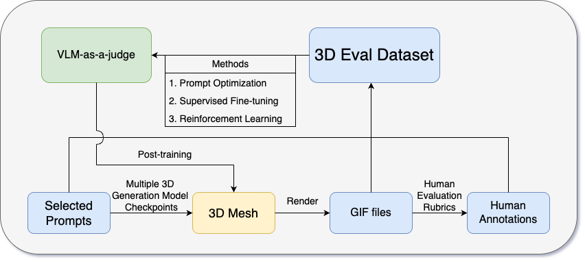

# 3DEval-dataset


---

The **dataset.csv** provides a benchmark dataset for evaluating 3D mesh. It contains human annotations for **Geometry** and **Prompt Adherence**, along with the corresponding text prompts and GIF visualizations of the generated 3D assets.

This dataset is intended to facilitate research on reliable evaluation protocols for modern 3D generative models.

---

## Dataset Contents

- **`dataset.csv`**  
  Metadata and human evaluation results for each 3D asset:
  - `Prompt`: Text prompt used to generate the 3D asset.
  - `gif_path`: File name of the GIF visualization of the 3D mesh.
  - `Geometry Rating`: Human rating of geometric quality.
  - `Prompt Adherence Rating`: Human rating of how well the mesh aligns with the prompt.

- **`GIFs/`**  
  Directory containing GIF visualizations of the 3D assets.  
  File names correspond to the `gif_path` column in the CSV file.

Below we present an example of the dataset.


Prompt: SUV

Geometry Rating: 2

Prompt Adherence Rating: 3

---

## Usage

### Clone the Repository


```bash
git clone https://github.com/nsjia/DB-3DME.git
cd 3DEval-dataset
```

---

### Load the Dataset

```python
import pandas as pd

df = pd.read_csv("dataset.csv")
```

---

### Convert GIFs to Grid Images

The script `gif_to_grid.py` converts a 3D asset GIF into a single grid image for convenient visualization and evaluation.

The script supports:
- Local GIF files in the repository
- External GIF files specified via HTTP URLs

#### Example

```bash
python gif_to_grid.py \
  --gif_path GIFs/output-0.gif \
  --rows 4 \
  --cols 6 \
  --output_path output_0.png
```

This command converts the input GIF into a `4 × 6` frame grid and saves it as a PNG image.

---


## For Review

This repo is prepared for paper under review at KDD 2026 D&B track. 

---